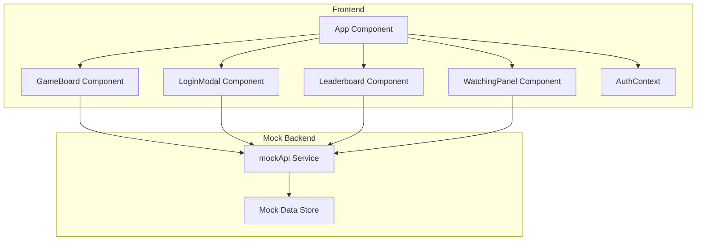

# Application Architecture

## Component Responsibilities

### App Component

- Main application container
- Manages global state (user auth, game mode)
- Coordinates between components

### GameBoard Component

- Renders the game grid
- Handles game logic (snake movement, collision detection)
- Manages game state (score, game over, pause)
- Communicates with mock API for game actions

### LoginModal Component

- Handles user authentication (login/signup)
- Form validation
- Communicates with mock API for auth operations

### Leaderboard Component

- Displays player rankings
- Fetches data from mock API

### WatchingPanel Component

- Shows players available for spectating
- Allows toggling watch status
- Communicates with mock API for watch actions

### AuthContext

- Provides authentication state to all components
- Enables components to access current user info

### mockApi Service

- Centralized mock backend service
- Simulates HTTP requests with delays
- Manages all data operations
- Easy to replace with real API client
